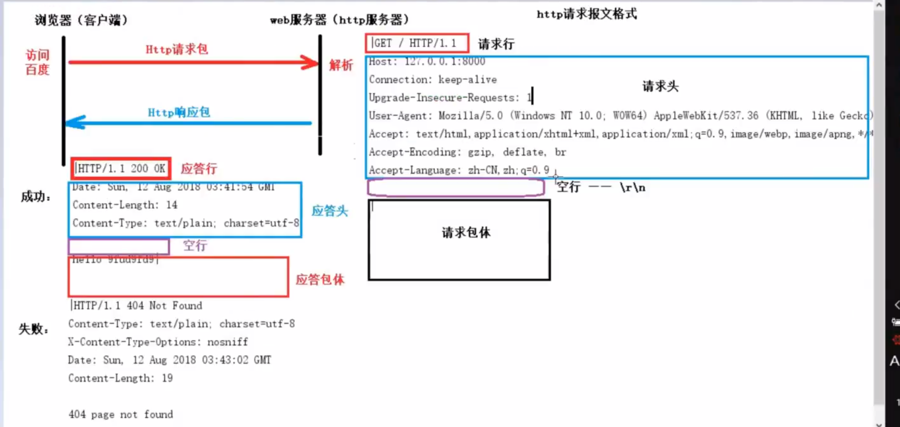
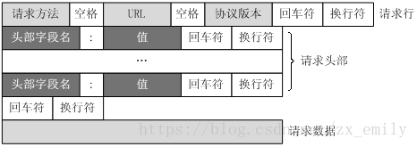

http响应报文格式
    请求行包括： 请求方法，URL(包括参数信息)，协议版本这些信息（GET /admin_ui/rdx/core/images/close.png HTTP/1.1）
    
    请求头部(Header)是一个个的key-value值，比如
    
    Accept-Encoding: gzip, deflate
    User-Agent: Mozilla/4.0 (compatible; MSIE 7.0; Windows NT 6.1; WOW64; Trident/7.0; SLCC2; .NET CLR 2.0.50727; .NET CLR 3.5.30729; .NET CLR 3.0.30729; .NET4.0C; .NET4.0E)
    空行(CR+LF)：请求报文用空行表示header和请求数据的分隔，表示http请求头结束
    
    请求数据：GET方法没有携带数据， POST方法会携带一个body

http应答包：
    
    1.使用net/http包，创建web服务器
        1)注册回调函数 http.HandleFunc("/itcast",handler)
            参数1：用户访问文件位置
            参数2：回调函数名 --- 函数必须是(w http.ResponseWriter, r *http.Request) 
                  做参数  
        2)绑定服务器监听地址http.ListenAndServe("addr",nil)